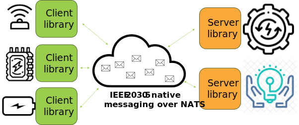

# Interoperable Client/Server for IEEE2030.5 communication between devices and EMS systems

Interoperable client/server is designed to provide an open source, out-of-the-box support for IEEE2030.5 communication between devices and EMS systems.
The objectives of the interoperable client/server are to:
- Provide an open source, out-of-the-box support for IEEE2030.5 communication between devices and EMS systems. The objective is to provide support for IEEE2030.5 messages in original XML format, as well as IEEE2030.5 in JSON format.
- Provide support for next generation NATS messaging as a communication protocol between devices and EMS systems, superseding other communication mechanisms (such as REST over HTTP) and enabling message-driven, loosely coupled and scalable communication platform.
- Provide a reference implementation as an open-source project, available on GitHub.

In this specification we have presented the architecture for the interoperable client/server (we will use the wording client/server in the rest of the document). It provides support for IEEE2030.5 messages in original XML format, as well as IEEE2030.5 in JSON format. It supports next generation NATS messaging as a communication protocol between devices and EMS systems, superseding other communication mechanisms (such as REST over HTTP) and enabling message-driven, loosely coupled and scalable communication platform.

The document describes the software architecture of the interoperable client/server library, usage scenarios and interfaces it provides. Client/server is not a standalone software product, but a software library to be used within devise and/or EMS systems to implement IEEE2030.5 over NATS.



## Prerequisites

Please note that this library facilitates the communication *transport* (IEEE 2030.5 messages over NATS) between endpoints. It does **not** provide the core IEEE 2030.5 client or server logic itself.

To effectively utilize this library, you must have existing IEEE 2030.5 client and server implementations operational. There are various options for setting up an IEEE 2030.5 server, including open-source solutions. One such example is the GridAPPS-D IEEE 2030.5 Server:

*   **GitHub:** [https://github.com/quantumscript/IEEE_2030_5_gridappsd_server](https://github.com/quantumscript/IEEE_2030_5_gridappsd_server)
*   **PyPI:** [https://pypi.org/project/gridappsd-2030-5/](https://pypi.org/project/gridappsd-2030-5/)

You will need to ensure your chosen IEEE 2030.5 client and server are running before integrating this library for NATS-based communication.

## Usage
Client/Server can be used in the project by importing the project from Maven Central or by using the JAR.

It is not standalone application, but a library that can be used in other projects. 
That is because users must implement few methods specific to their use cases.

## Mapping to the IEEE2030.5
The project contains all the classes that are used in the IEEE2030.5 standard.
Users can use these classes to map the messages to the IEEE2030.5 objects and vice versa.

Helper class `IEEEObjectFactory` is used to map the messages to the IEEE2030.5 objects and vice versa.
Methods `fromJSONToIEEE` and `fromXMLToIEEE` are used to map the messages to the IEEE2030.5 objects.
Methods `fromIEEEToJSON` and `fromIEEEToXML` are used to map the IEEE2030.5 objects to the messages.

Example of mapping a message to the IEEE2030.5 Event from JSON and then to XML is shown below:
```java
String message = """
            {
              "creationTime": 1702909917932,
              "eventStatus": {
                "currentStatus": 1,
                "dateTime": 1693216835000,
                "potentiallySuperseded": false
              },
              "interval": {
                "duration": 900,
                "start": 1693216835000
              }
            }
            """;

Event event = IEEEObjectFactory.fromJSONToIEEE(message, Event.class);

String xml = IEEEObjectFactory.fromIEEEToXML(event);
```

Example of mapping a message to the IEEE2030.5 Event from XML and then to JSON is shown below:
```java
String message = """
            <Event>
            	<creationTime>1702909917932</creationTime>
            	<EventStatus>
            		<currentStatus>1</currentStatus>
            		<dateTime>1693216835000</dateTime>
            		<potentiallySuperseded>false</potentiallySuperseded>
            	</EventStatus>
            	<interval>
            		<duration>900</duration>
            		<start>1693216835000</start>
            	</interval>
            </Event>
            """;

Event event = IEEEObjectFactory.fromXMLToIEEE(message, Event.class);

String json = IEEEObjectFactory.fromIEEEToJSON(event);
```

## NATS
The project contains the `Server` and `Client` class that is used to connect to the NATS server and to send and receive messages.

Example of using the `Server` class is shown below:
```java
Options options = new Options.Builder().server("nats://localhost:4222").build();

NatsConnection natsConnection = new NatsConnection();
try {
    natsConnection.connectSync(options, false);

    Server server = new Server(natsConnection);

    server.subscribe("devices.event", message -> {
        String msg = new String(message);
        log.info("Received message: {}", msg);

        Event event = IEEEObjectFactory.fromXMLToIEEE(msg, Event.class);
        // Do something with the event

        server.publish("events.event", IEEEObjectFactory.fromIEEEToJSON(event));
    });
} catch (IOException | InterruptedException e) {
    log.error("Failed to connect to NATS server", e);
}
```

# License
MIT
